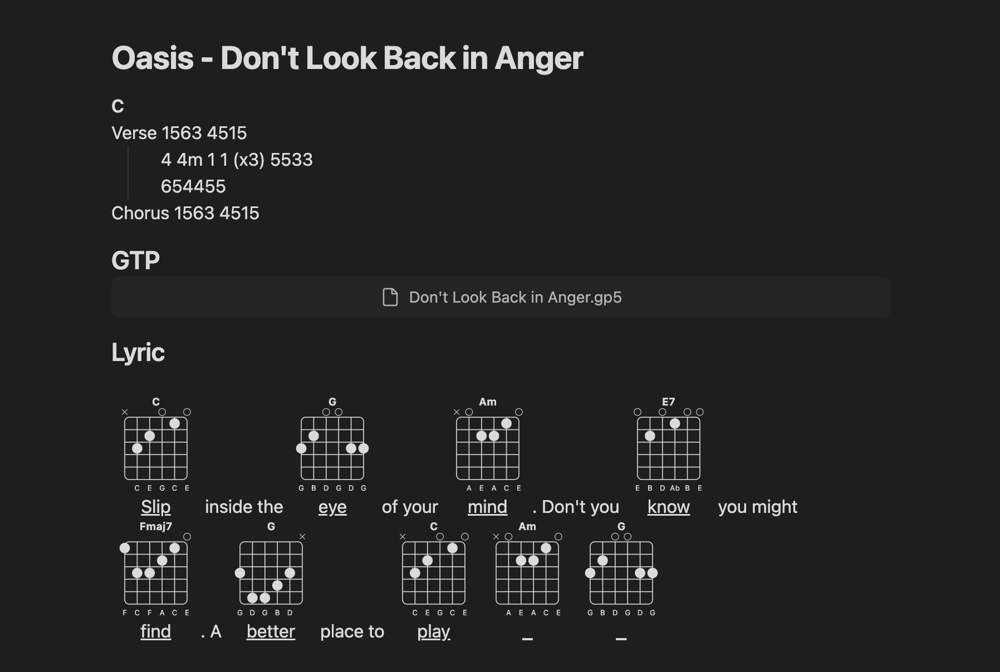
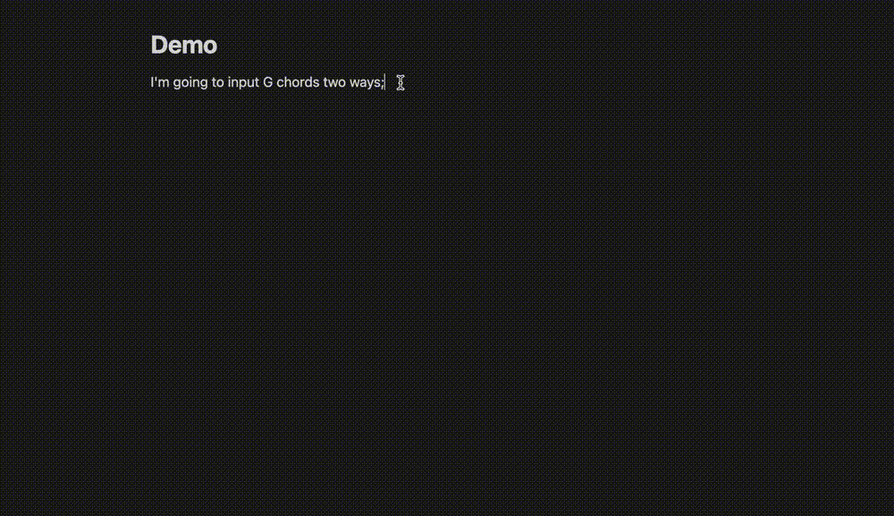

# Obsidian ChordCard Plugin

Quickly enter and display guitar chords, with optional chords based on music theory. All chords are valid chords generated based on chord theory, and support custom chords.
No need to write in code blocks, they can be inserted and edited directly in the document.

## Usage
You can combine it with other plugins for more convenient use.

1. with [Slash commander](https://github.com/alephpiece/obsidian-slash-commander)

2. with [Editor toolbar](https://github.com/PKM-er/obsidian-editing-toolbar)

Of course, the most direct and basic usage is to use obsidian command(`ctrl + p`). And you can find that there are two ways to enter chords.
1. Enter chord name, like `Am7`;
2. Enter the finger position, for example `x32010` for C chord;

